## Lab3
### Modules maven 
Créer un projet maven nommé commandes : projet parent
- Le projet parent est juste un projet maven
- Créer les modules maven suivants services, web
  - services sera un projet gere le metier de l'application
  - web est une application angular

### Prérequis
- JDK 17
- Maven 3.*
- Docker
- npm

### Configurations
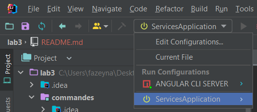
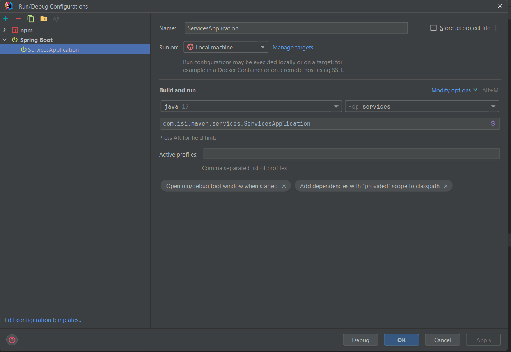
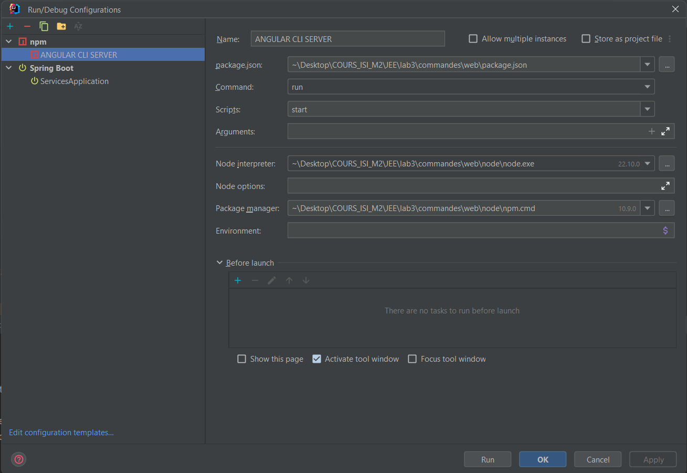

### LOGS
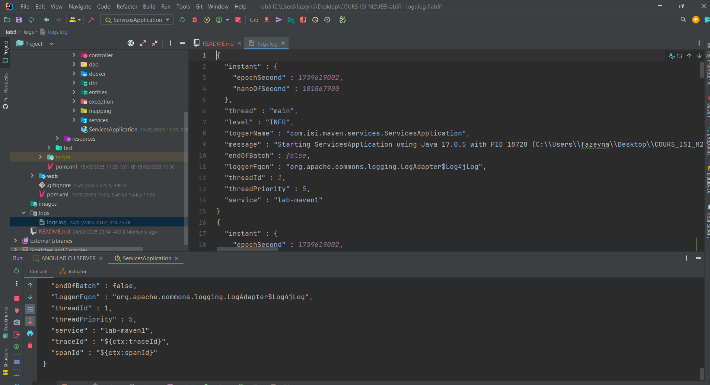

### Base de données
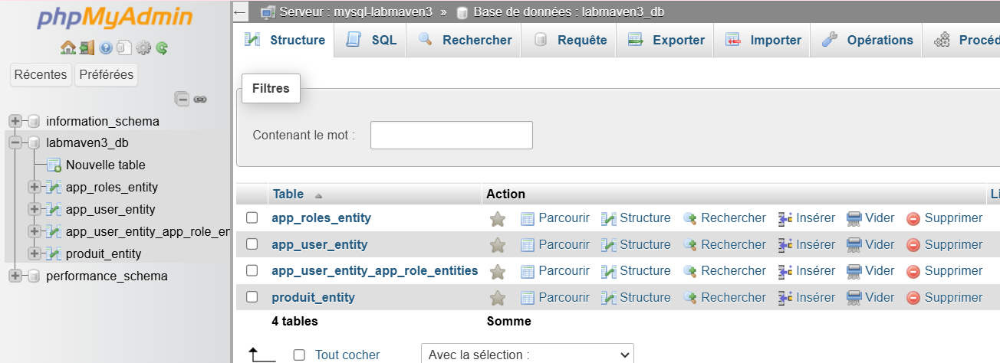

### Captures de quelques pages
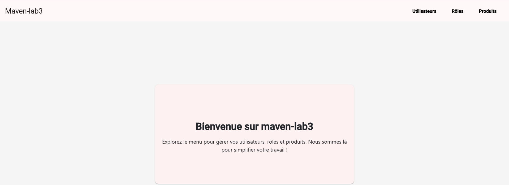
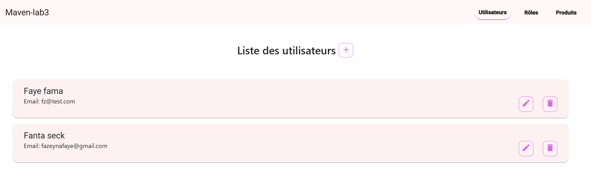
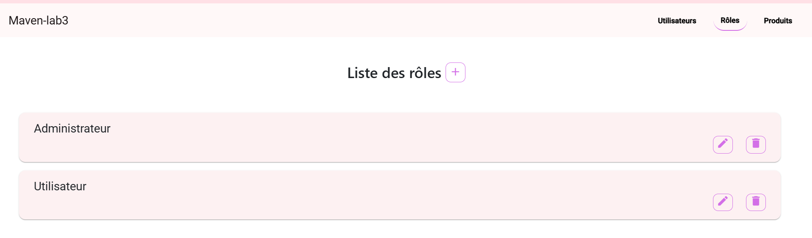
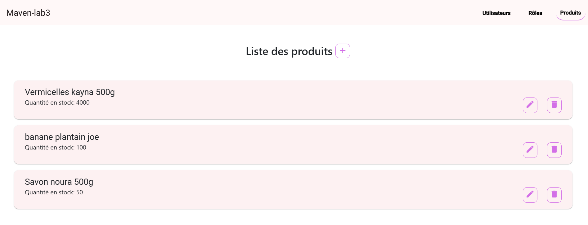
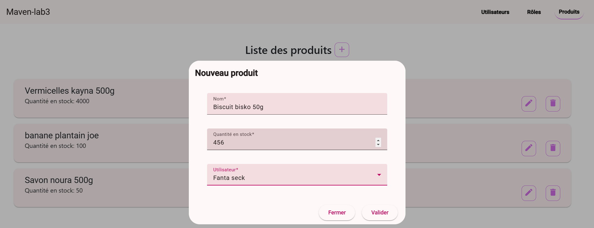
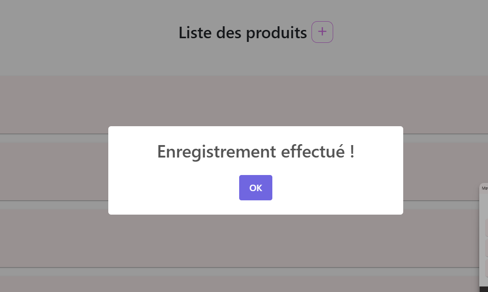
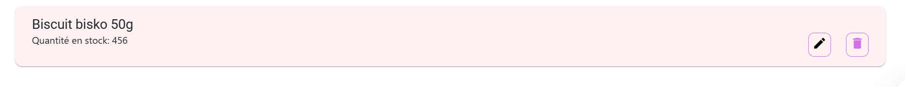
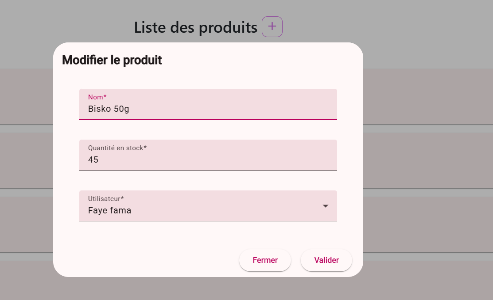
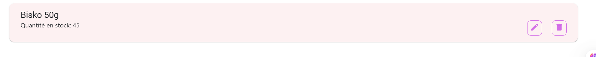
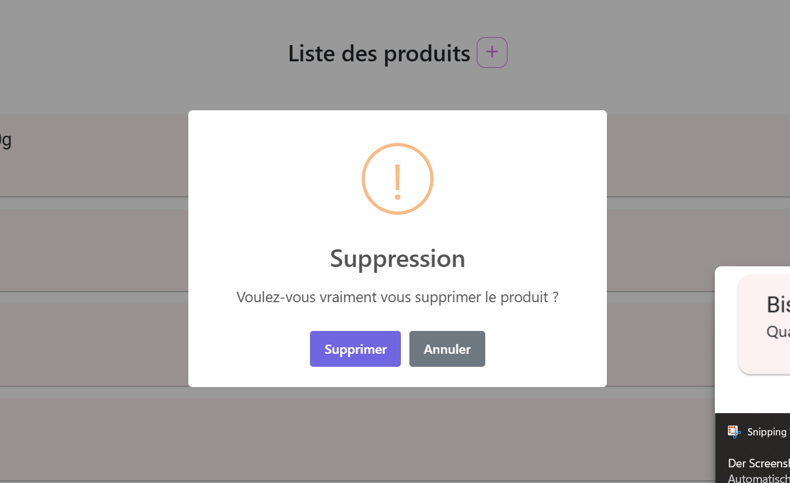
